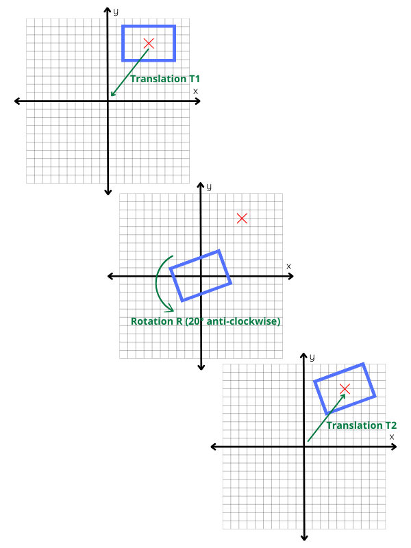
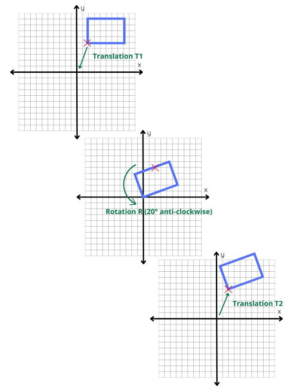

# 3x3-2D-transformations_demo
Shows 3x3 matrices use for simple 2D transformations (translation, rotation, scaling…)

## The translation problem

As seen [here](https://github.com/Jehadel/2D_transformations_demo) we can use 2x2 matrices to performs some 2D transformations (rotations, flips…) but this method has major drawbacks : we can’t perform translation, some transformations lead to unwanted translations, and the transformations are relative to the coordinates origin/axes.

How could we uses matrices to perform translations ?

To translate a point 10 units along the x axis and 8 units along the y axis, we can peform the arithmetics :

$$ x_t = x + 10 \\\
    y_t = y + 8 
$$

2x2 matrices can’t express such transformation :

$$ \begin{bmatrix} x \\\ y \end{bmatrix} . 
    \begin{bmatrix} a & b \\\ 
    b & c\end{bmatrix} = 
    \begin{bmatrix} x.a + 
    y.b & x.c + 
    y.d\end{bmatrix} 
$$

Each term is either a multiple of x or a multiple of y. We can’t add a constant.

But if we note that $$ x + 10 = x.1 + y.0 + 1.10 $$ we can write :

$$ \begin{bmatrix}x & y & 1\end{bmatrix} . 
    \begin{bmatrix} 1 \\\ 0 \\\ 10 \end{bmatrix} = 
    x + 10 
$$

for y :

$$ \begin{bmatrix}x & y & 1\end{bmatrix} . 
    \begin{bmatrix} 0 \\\ 1 \\\ 8 \end{bmatrix} = 
    y + 8 
$$

and finally :

$$ \begin{bmatrix}x & y & 1\end{bmatrix} . 
    \begin{bmatrix} 0 \\\ 0 \\\ 1 \end{bmatrix} = 
    1 
$$

So, if we accept to add a third term equal to 1 at the coordinates (that will be ignored when drawing figures) we can perform translation with a 3x3 matrix :

$$ \begin{bmatrix} x & y & 1 \end{bmatrix} . 
    \begin{bmatrix} 1 & 0 & 0 \\\ 
                0 & 1 & 0 \\\ 
                t_x & t_y & 1 \end{bmatrix} =
    \begin{bmatrix} x + t_x & y + t_y & 1\end{bmatrix}
$$

## 3x3 matrices for other transformations

Following the same process, we can build 3x3 matrices for the transformations seen before :

### Rotation (clockwise)

$$ \begin{bmatrix} \cos \theta & -\sin \theta & 0 \\\
                   \sin \theta & \cos \theta & 0 \\\
                   0 & 0 & 1 \end{bmatrix} 
$$

### Rotation (anti-clockwise)

$$ \begin{bmatrix} \cos \theta & \sin \theta & 0 \\\
                   -\sin \theta & \cos \theta & 0 \\\
                   0 & 0 & 1 \end{bmatrix} 
$$

### Horizontal flip

$$ \begin{bmatrix} -1 & 0 & 0 \\\
                   0 & 1 & 0 \\\
                   0 & 0 & 1 \end{bmatrix}
$$

### Vertical flip

$$ \begin{bmatrix} 1 & 0 & 0 \\\
                   0 & -1 & 0 \\\
                   0 & 0 & 1 \end{bmatrix}
$$

### Scaling

$$ \begin{bmatrix} S_x & 0 & 0 \\\
                   0 & S_y & 0 \\\
                   0 & 0 & 1 \end{bmatrix} 
$$

### x-axis « bending »

$$ \begin{bmatrix} 1 & 0 & 0 \\\
                   S_x & 1 & 0 \\\
                   0 & 0 & 1 \end{bmatrix} 
$$

### y-axis « bending »

$$ \begin{bmatrix} 1 & S_y & 0 \\\
                   0 & 1 & 0 \\\
                   0 & 0 & 1 \end{bmatrix} 
$$

All those 3x3 matrices correspond to axes/origin centered transformations, as with 2x2 matrices. Let’s see how the new possibility of translation can help us to generalise those transformations, via a combination of transformations.

## Generalized transformations

To process a rotation centered on any point, we just have to follow a 3 steps process : translate the figure to bring the rotation point to the origin, rotate, and translate back the figure to its original position

this 3 steps process is correct for any chosen point, here the bottom left vertex of the rectangle :

How do we combine those 3 transformations ? By successively applying the corresponding transformation matrices (translation consist to bring the point C - center of the rotation - of coordinates $$\begin{bmatrix} C_x & C_y \end{bmatrix} $$  to the origin $$ \begin{bmatrix} 0 & 0 \end{bmatrix} $$

Perform the rotation and then translate back the figure to C. It means that Cx and Cy are not only the coordinates of C, but also the parameters of the translation.

$$ \begin{bmatrix} x & y & 1 \end{bmatrix} . T1 . R . T2 = \\
    \begin{bmatrix} x & y & 1 \end{bmatrix} . 
    \begin{bmatrix} 1 & 0 & 0 \\\ 
                0 & 1 & 0 \\\ 
                -C_x & -C_y & 1 \end{bmatrix} .
    \begin{bmatrix} \cos 20\degree & \sin 20\degree & 0 \\\
                    –\sin 20\degree & \cos 20\degree & 0 \\\
                    0 & 0 & 1 \end{bmatrix} .
    \begin{bmatrix} 1 & 0 & 0 \\\
                    0 & 1 & 0 \\\
                    C_x & C_y & 1 \end{bmatrix}
$$

We can of course multiply the transformations matrices together to obtain a combined transformation matrix. Just be aware that matrix product is non-commutative : the order is important.

$$ T1 . R . T2 = \\
\begin{bmatrix} \cos 20\degree & \sin 20\degree & 0 \\\
                -\sin 20\degree & \cos 20\degree & 0 \\\
                C_x(1-\cos 20\degree) + C_y \sin 20\degree & C_y(1-\cos 20\degree) - C_x \sin 20\degree & 1 \end{bmatrix}
$$

But it’s not really necessary to calculate a combined matrix when we design a transformation script.

We can apply the same logics to all transformations.

See the source code comments for more details !